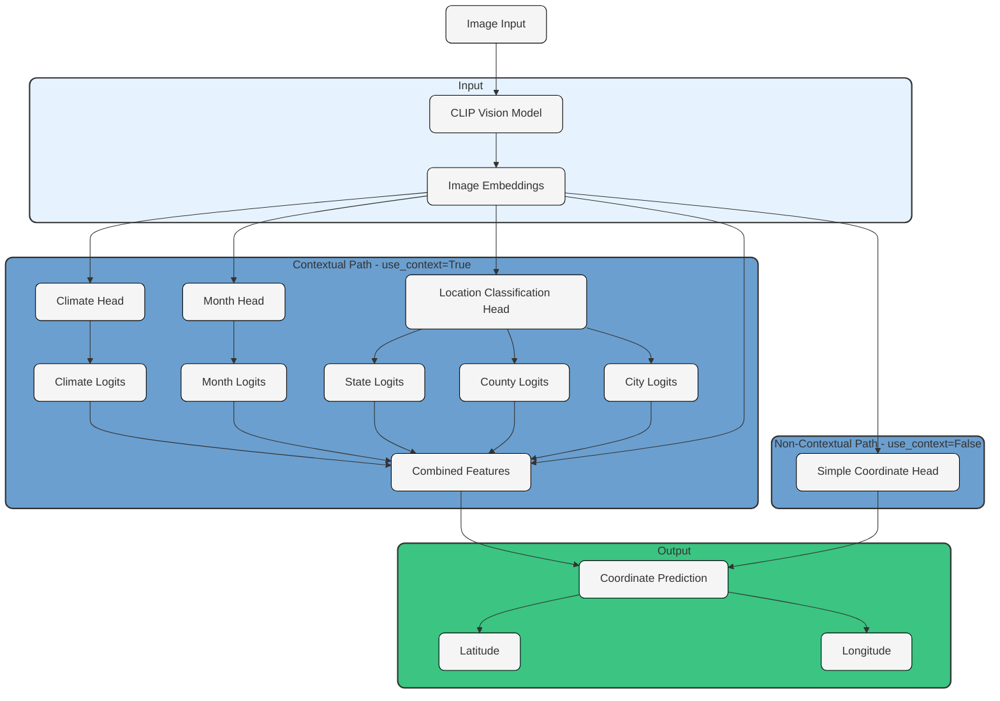

# geolocation_clip -> Image based Geolocation
Training and eval code for image Geolocation on the OSV-Mini-129k. Image in, latitude and longitude prediction estimate out. Trained with street view imagery. This project provides modular geolocation models that can predict the location (latitude, longitude) of images. The models can optionally use auxiliary prediction heads to improve accuracy by predicting additional contextual information such as climate, month, state, county, and city.

We offer several image classification backbones for training with an option to use contextual geographic features in the classification head to further aid in location refinement.

## GeoCLIP Model Description:

- For the CLIP backbone:
  - MultiModal Vision/Text Base CLIP model
  - Contrastive Pretraining
    - Pretrained CLIP model, trained again with contrastive pretraining for the vision/text alignment. 
    - The contrastive pretraining aligns the text embeddings and image embeddings with geographic features.
    - For this step, I created a caption with with the desired contextual features: Climate, city, county, state and month.
  
**Classification Heads**
- Location Coordinate: lat, lon
  - Always present to produce the latitude and longitude, whether or not the auxilary heads and contextual features are present. 
- Auxiliary heads (only used if use_context is True)
    - Location Classification: state, county, city
    - Climate Classification: Climate (0-29 integer)
    - Month Classification: 
    - The logits from these heads are passed as input to to the location pred head to improve accuracy.

